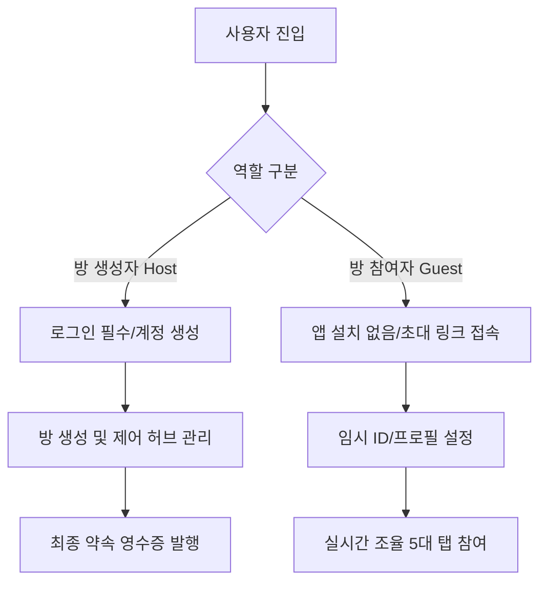

# 🤝 바로약속 - 제품 요구사항 정의서 (PRD)

> **"복잡한 약속 조율 과정을 실시간 동기화와 직관적인 UI로 해결하는 웹 기반 약속 조율 서비스"**
> 
> 바로약속은 방 설립자(Host)의 관리 편의성과 초대자(Guest)의 접근성(앱 설치 무관)을 극대화하여 조율의 완결성을 높이는 데 집중합니다.

---

## 1. 프로젝트 개요 (Project Overview)

* **서비스명**: 바로약속
* **핵심 가치**: 
  * ⚡ **실시간성**: 기다림 없는 양방향 데이터 업데이트
  * 📱 **초경량 진입**: 가입이나 앱 설치 없이 링크만으로 즉시 조율 참여
  * 🎨 **직관적 UI/UX**: 이모지 아바타와 사용자별 퍼스널 컬러 기반의 투명한 시각적 피드백

---

## 2. 사용자 권한 및 진입 정책 (Core Policy)

서비스 내 사용자는 크게 **방 설립자(Host)**와 **방 초대자(Guest)**로 구분되며, 각각 다른 권한과 진입 정책을 가집니다.

### 2.1. 방 설립자 (Host)
* **필수 조건**: 서비스 내 계정 생성 및 로그인 필수 (웹/앱 환경 지원)
* **핵심 권한**: 
  * 룸(약속 방) 개설 및 비공개 모드 등 설정 제어
  * 참여자 데이터 및 약속 상태 관리
  * 조율 완료 후 최종 **'약속 영수증'** 발행

### 2.2. 방 초대자 (Guest)
* **필수 조건**: 앱 설치 불필요 (Web-based 즉시 접속 지원)
* **식별 체계**: 공유 링크 접속 시 **임시 아이디(Temporary ID)** 발급 및 초간단 프로필 설정
* **핵심 권한**: 시간/장소 투표, 실시간 채팅, 룰렛 참여 등 서비스 내 모든 조율 기능 이용 가능
* **데이터 투명성**: 시간 및 장소 투표 시 임시 아이디와 아바타(이모지)가 실시간으로 매핑되어, 누가 어떤 항목을 골랐는지 즉시 직관적으로 시각화됨

---

## 3. 기능 명세서 (Functional Requirements)

### 3.1. 온보딩 및 식별 시스템 (Onboarding & Identity)
* **Host 온보딩**: 구글, 카카오 및 이메일 소셜 로그인 후 메인 대시보드 진입
* **Guest 온보딩**: 초대 링크 접속 ➡️ `닉네임 / 아바타(이모지 팩) / 퍼스널 컬러` 입력 후 즉시 방 입장
* **상태 유지**: 임시 세션 스토리지(Session Storage)를 활용하여 브라우저 재접속 시에도 이전 프로필 상태가 안전하게 유지됨

### 3.2. 실시간 데이터 및 시스템 아키텍처 (Real-time Architecture)
* **실시간 동기화**: **Firebase Firestore**의 Listener를 활용하여 참여자들의 투표 현황, 실시간 채팅, 위치 정보를 모든 참여자 디바이스에 양방향 실시간 동기화
* **예외 복구 (Fallback)**: 일시적인 오프라인 환경에서도 로컬 스토리지를 활용하여 데이터를 임시 저장하고, 연결 재개 시 자동으로 동기화하여 끊김 없는 사용자 경험 제공
* **상태 관리**: **React Context**를 구축하여 세션 정보 및 실시간 룸 데이터(투표/메시지/위치)를 전역에 효율적으로 유통

### 3.3. 룸 핵심 5대 조율 탭 (Core 5 Tabs)

| 탭 종류 | 기술적 상세 | 핵심 UI/UX 피드백 |
| :--- | :--- | :--- |
| **📅 일정 조율** `CalendarTab` | - 09:00 ~ 23:00 정시 단위 투표 시스템 | - 참여자 아바타 스택(이모지 누적) 배치 - 최적 시간대인 **"Best"** 시간대에 펄스(Pulse) 애니메이션 효과 적용 |
| **📍 장소 조율** `LocationTab` | - 카카오 지도 SDK 연동 - 실시간 GPS 기반 위치 정렬 | - 반경 1km 추천 엔진 제공 (맛집, 카페, 주차장 등) - 제안자별 마커 오버레이에 **이모지 + 퍼스널 컬러** 강조 |
| **💬 실시간 소통** `ChatTab` | - 초고속 실시간 메신저 - 메시지 수신 시 부드러운 자동 스크롤 | - 탭 이동을 돕는 **딥링크(Deep Link) 발행** 지원 - 예: `[LINK:calendar]`, `[LINK:location]` 터치 시 해당 탭으로 즉시 미끄러지듯 이동(Smooth scroll/tab switch). |
| **🎲 결정 도우미** `RouletteTab` | - 장소 후보군 실시간 롤링 추첨 알고리즘 | - 추첨 과정의 시각화 및 최종 결과 오버레이 팝업 제공 |
| **🏁 마무리 탭** `WrapupTab` | - 최종 확정 약속의 요약본 생성 | - 한눈에 보는 **'약속 영수증'** 시각화 - PNG/PDF 다운로드 저장 지원 및 최신 브라우저 호환 포맷 포팅 |

---

## 4. 대시보드 및 방 생성 (Dashboard & Creation)

* **방 제어 허브 (Dashboard)**: 고유 참여 코드 입력(예: `SKY-LARK-22`)을 통한 간편 입장 및 최근 참여한 약속방 리스트 로컬 바인딩
* **약속 방 개설 (Creation)**: 
  * **약속 성격 지정**: 목적에 따른 칩(Chip) 선택 (예: ☕ 카페, 🍖 맛집, 💻 스터디 등)
  * **정원 설정**: 숫자 카운터를 통한 참여 인원 제한
  * **비공개 모드**: 토글 스위치 형태의 비밀번호/공개 여부 제어

---

## 5. 공유 및 확장 기능 (Sharing & Extension)

* **초대 시스템**: 
  * 클립보드 링크 복사
  * **카카오톡 공유 피드 API** 공식 연동 ➡️ 약속의 타이틀, 핵심 요약 정보 및 앱/웹 딥링크가 포함된 맞춤형 초대장 템플릿 실시간 자동 전송

---

## 6. 스타일링 및 디자인 가이드 (Styling & Design Guidelines)

### 6.1. 디자인 언어 & 기술 스택
* **기술 스택**: `React.js` + `Tailwind CSS v4` + `Lucide Icons`
* **상태 관리**: `React Context` (`RoomContext`)
* **백엔드 / 실시간 데이터베이스**: `Firebase Firestore` (Real-time synchronization)

### 6.2. UI/UX 컨셉 및 인터랙션
* **스타일 테마**: 현대적이고 트렌디한 **글래스모피즘(Glassmorphism)**, 정교한 **마이크로 인터랙션** 적용
* **퍼스널 컬러 시스템**: 참여자별 고유 컬러 매칭 지원 
  * `Red` | `Orange` | `Yellow` | `Green` | `Blue` | `Purple` | `Pink`
* **시각화 강화**: 투표 버튼 클릭이나 메시지 입력 시, 사용자의 퍼스널 컬러와 이모지 아바타가 강조되어 소통의 신뢰성과 재미 요소 확보
* **모바일 퍼스트(Mobile-First)**: 모바일 및 PC 화면 크기에 상관없이 깨짐이나 스크롤 꼬임이 없는 완벽한 반응형 레이아웃 설계

---

## 7. 자동화 및 보안 정책 (Automation & Security)

> [!IMPORTANT]
> **데이터 소멸 정책 (Data Lifecycle)**
> * 개인정보 보호 및 DB 용량 효율화를 위해, 모든 룸 데이터는 **'약속 확정 날짜'의 24시간 뒤**에 시스템에 의해 자동으로 완전히 만료 및 영구 삭제됩니다.
> * 데이터 폐기 시 모든 참여자의 개인 대화, 실시간 GPS 위치 정보, 투표 정보가 안전하게 파기됩니다.

> [!TIP]
> **디바이스 최적화**
> * PC의 넓은 대화면뿐만 아니라 다양한 모바일(iOS/Android) 기기의 노치 디자인이나 브라우저 바텀 시트 영역을 고려하여 오차 없이 꽉 찬 풀스크린 UI를 제공합니다.

---

## 8. 개발팀 다짐
* 🫶 **사용자의 소중한 약속 시간이 즐겁고 매끄러운 경험이 될 수 있도록 최선을 다해 개발합니다!**
