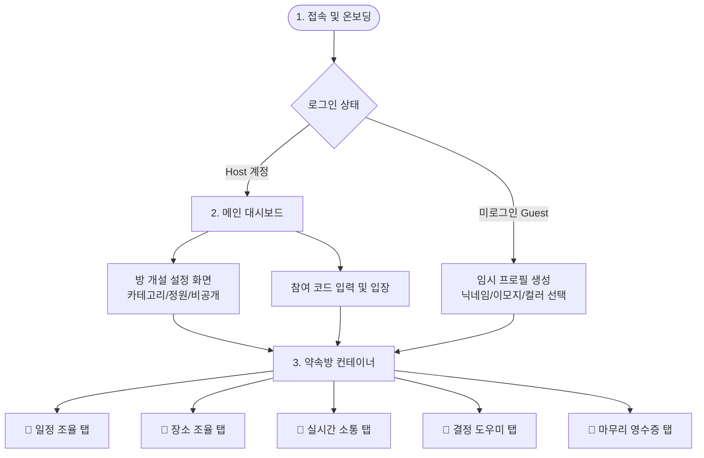

# 🤝 바로약속 (Baro-Yaksok) 개발 산출물 명세서

본 문서는 실시간 약속 조율 서비스인 **바로약속 (Baro-Yaksok)** 프로젝트의 개발 과정 및 최종 결과물을 바탕으로 작성된 공식 개발 산출물입니다. 시스템의 개요부터 요구사항 정의, 기능 명세, UI/UX 구조 및 흐름, 그리고 기술 스택에 이르기까지 프로젝트의 전반적인 아키텍처를 상세하게 정리하였습니다.

---

## 1. 프로젝트 개요 (Project Overview)

### 1.1. 서비스 정의 및 배경
* **서비스명**: 바로약속 (Baro-Yaksok)
* **개발 목적**: 여러 명의 참여자가 모여 약속 시간과 장소를 잡을 때 발생하는 복잡하고 비효율적인 소통 과정을 해결하고자 합니다. 실시간 동기화와 직관적인 인터랙션을 통해 의사결정 속도를 높이고 조율의 피로감을 최소화하는 데 집중합니다.
* **핵심 가치**:
  * ⚡ **실시간성 (Real-time Sync)**: Firebase Firestore 리스너를 통한 딜레이 없는 실시간 동기화.
  * 📱 **초경량 진입 (Zero-barrier Entry)**: 별도의 앱 설치나 까다로운 회원가입 절차 없이, 초대 링크만으로 즉시 조율 참여 가능.
  * 🎨 **직관적인 UI/UX**: 이모지 아바타와 7가지 퍼스널 컬러 시스템을 활용하여 투명하고 재미있는 시각적 피드백 제공.

### 1.2. 타겟 유저
* **방 설립자 (Host)**: 약속을 주도하고 생성하며 최종 일정을 확정하고자 하는 사용자 (소셜 로그인 연동 필요).
* **방 초대자 (Guest)**: 설치나 가입 없이 링크 접속만으로 즉시 참여하고자 하는 가벼운 사용자 (임시 세션 프로필 생성 후 진입).

---

## 2. 제품 요구사항 정의 (PRD 요약)

### 2.1. 핵심 유저 스토리 (User Story)
* **방 생성**: "방 설립자(Host)는 약속의 성격(카테고리), 모집 정원, 공개 여부(비밀번호 설정)를 지정하여 12자리 고유 방 코드(예: `XXXX-XXXX-XX`)가 부여된 약속 조율 방을 손쉽게 개설할 수 있다."
* **간편 참여**: "방 초대자(Guest)는 앱 설치나 가입 없이 초대 링크 클릭 또는 코드 입력으로 접속하고, 즉석에서 이모지 아바타와 컬러 닉네임을 설정하여 1초 만에 방에 입장할 수 있다."
* **일정/장소 조율**: "참여자들은 캘린더 상에서 원하는 시간대에 실시간 투표를 진행하고, 카카오 지도를 통해 원하는 약속 후보지와 편의시설을 실시간으로 확인하며 투표할 수 있다."
* **결정 및 확정**: "합의되지 않는 장소 후보는 내장된 룰렛 추첨기를 이용해 공정하게 결정하고, 방장은 확정된 시간과 장소를 토대로 영수증 형태의 '최종 약속 카드'를 생성 및 소장용 이미지로 저장할 수 있다."

### 2.2. 해결하고자 한 핵심 문제 (Problem & Solution)
* **기존 문제**: 약속 하나를 잡기 위해 수십 개의 단톡방 메시지를 주고받아야 하거나, 다른 유저가 언제 되는지 파악하기 어려워 조율 과정이 지연되는 현상.
* **해결 방안**: 
  * 투표자 현황이 실시간으로 누적 및 병합 시각화되는 반응형 시간 그리드 제공.
  * 퍼스널 컬러와 이모지 마커로 한눈에 지도 위에 투표자가 표시되는 장소 핀보드 제공.
  * 탭 간 자연스러운 이동을 유도하는 채팅 내 딥링크 기능 및 긴급 푸시 알림성 넛지(화면 흔들림 및 진동) 제공.

---

## 3. 기능 명세서 (Functional Specification)

본 서비스의 핵심 기능은 전역 상태 관리 컨텍스트인 [RoomContext.jsx](file:///c:/Users/kimji/OneDrive/Desktop/When.are.we.meeting/src/context/RoomContext.jsx)를 중심으로 구성되어 있습니다.

| 분류 | 기능 ID | 기능명 | 설명 | 구현 여부 |
| :--- | :--- | :--- | :--- | :---: |
| **인증 & 세션** | AUTH-01 | Host 로그인 | 구글/카카오/이메일 기반 로그인 지원 및 대시보드 진입 | 구현 완료 |
| | AUTH-02 | Guest 임시 프로필 생성 | 닉네임(최대 10자), 이모지 아바타 16종, 퍼스널 컬러 7종을 조합하여 즉시 가상 식별자 생성 | 구현 완료 |
| | AUTH-03 | 세션 상태 유지 | 브라우저를 재부팅하거나 새로고침해도 Session Storage를 통해 세션 및 정보 유지 | 구현 완료 |
| **대시보드** | DASH-01 | 12자리 코드 입장 | `ABCD-EFGH-12` 포맷 자동 대시 대입 기능 및 비공개 방 비밀번호 체크 진입 | 구현 완료 |
| | DASH-02 | 방 생성 허브 | 카테고리 지정(카페, 맛집, 스터디 등), 정원 제어, 비공개 모드(패스워드) 설정 | 구현 완료 |
| | DASH-03 | 최근 참여 목록 | 로컬 스토리지를 트래킹하여 최근에 방문한 약속 방 목록 표시 및 퀵 진입 제공 | 구현 완료 |
| **일정 조율** | TAB-CAL | Calendar 투표 | 09:00 ~ 23:00 정시 단위 시간 투표 그리드. 투표 수 누적 시 아바타 스택 및 가시적 열분포 표시. 최다 득표 시간대에 **"Best"** 펄스 뱃지 자동 렌더링. | 구현 완료 |
| **장소 조율** | TAB-LOC | Kakao Map 연동 | 카카오 맵 SDK 탑재. 주소/장소 키워드 검색, 반경 1km 추천 검색(식당, 카페 등), 장소별 추천/반대 투표 및 생성자 컬러 기반 마커 오버레이 연동. | 구현 완료 |
| **실시간 소통** | TAB-CHA | 실시간 메신저 | 실시간 메시지 동기화 및 넛지 폭탄(화면 흔들림 + 디바이스 진동 유발), 탭 이동 딥링크 기능(`[LINK:calendar]`, `[LINK:location]` 등 클릭 시 탭 스위치) 제공. | 구현 완료 |
| **결정 도우미** | TAB-ROU | 실시간 룰렛 추첨 | 후보 장소를 실시간으로 링 위에 배치하고, 물리적 회전 애니메이션 연출 후 최종 당첨 결과 팝업 노출. | 구현 완료 |
| **마무리** | TAB-WRA | 약속 영수증 발행 | 최종 날짜, 시간, 장소, 정원 등 조율 결과를 영수증 테마 디자인으로 시각화. PNG/PDF 저장 기능 및 클립보드 내보내기 지원. | 구현 완료 |
| **공유 & 보안** | COMM-01 | 카카오톡 공유 API | 카카오톡 공식 공유 피드 API 연동을 통해 초대장 발송 및 웹 딥링크 링크 연결 | 구현 완료 |
| | SEC-01 | 데이터 자동 소멸 | 보안과 효율적 스토리지 관리를 위해 약속 확정 날짜 기준 24시간 이후 DB 내 자동 파기 처리 | 구현 완료 |

---

## 4. 화면 구조 및 UI 흐름 (Screen Flow & Layout)

### 4.1. 서비스 진입 및 메인 Flow

### 4.2. 주요 화면별 UI 설명

#### 1) 메인 대시보드 ([Dashboard.jsx](file:///c:/Users/kimji/OneDrive/Desktop/When.are.we.meeting/src/views/Dashboard.jsx))
* **디자인 테마**: 깔끔하고 미니멀한 화이트 글래스모피즘(Glassmorphism) 스타일 카드.
* **구성 요소**:
  * **참여 코드 입력창**: 입력 시 자동으로 대시가 생성되는 입력 폼. 비밀번호 유무를 자동 감지하여 비공개 방일 때만 하단 비밀번호 입력 슬롯이 펼쳐집니다.
  * **방 만들기 CTA 버튼**: Crimson 색상의 입체감 있는 그라데이션 카드로, 호스트 권한으로 바로 약속 방 설정을 띄웁니다 (비회원 로그인 유도 락 처리).
  * **최근 참여 약속 목록**: 로컬 스토리지 정보를 가져와 참여했던 방의 카테고리 이모지, 제목, 코드를 카드형태로 나열하여 클릭 한 번으로 빠른 재입장이 가능합니다.

#### 2) 방 컨테이너 ([RoomContainer.jsx](file:///c:/Users/kimji/OneDrive/Desktop/When.are.we.meeting/src/views/RoomContainer.jsx))
* **상단 헤더**: 약속 타이틀, 12자리 복사 가능한 코드, 카카오톡/링크 듀얼 공유 팝오버, 대피를 위한 방 나가기 버튼이 위치합니다.
* **멤버 트레이**: 현재 접속한 참여자들의 이모지와 닉네임 뱃지가 가로 스크롤로 나열되며, 방장의 경우 별(★) 마크가 표시되어 역할 가시성을 높였습니다.
* **하단 탭바**: 5개의 핵심 조율 영역(일정, 장소, 소통, 룰렛, 마무리)으로 즉시 전환이 가능한 Bottom Navigation Bar가 상주하며, 활성화 탭은 현재 로그인한 사용자의 퍼스널 컬러 테마로 동적 변환됩니다.

#### 3) 일정 조율 ([CalendarTab.jsx](file:///c:/Users/kimji/OneDrive/Desktop/When.are.we.meeting/src/tabs/CalendarTab.jsx))
* **시간 슬롯 표**: 오전 9시부터 오후 11시까지 정시 단위 셀이 열(Column) 방향으로 시각화됩니다.
* **투표 상태 연동**: 특정 시간 셀을 터치하면 내 프로필의 이모지 아바타가 스택 구조로 추가되어 누적 투표수가 직관적으로 표현됩니다.
* **최적 추천**: 가장 투표수가 높은 구간에 **"Best"** 펄스 뱃지가 실시간으로 활성화되어 협의 지점을 바로 식별할 수 있습니다.

#### 4) 장소 조율 ([LocationTab.jsx](file:///c:/Users/kimji/OneDrive/Desktop/When.are.we.meeting/src/tabs/LocationTab.jsx))
* **지도 영역**: 카카오 맵 SDK가 탑재되어 지도 내 추천 장소들이 핀 마커로 렌더링됩니다. 제안한 사람의 고유 퍼스널 컬러가 핀 꼬리표에 반영됩니다.
* **장소 검색 & 리스트**: 우측 또는 하단 검색바에서 키워드로 장소를 찾아 후보군에 올릴 수 있고, 후보 리스트에는 추천/반대 투표 아이콘이 존재하여 장소 선호도를 정량적으로 파악합니다.

#### 5) 실시간 소통 및 넛지 ([ChatTab.jsx](file:///c:/Users/kimji/OneDrive/Desktop/When.are.we.meeting/src/tabs/ChatTab.jsx))
* **실시간 대화창**: Firestore Listener를 통한 초고속 채팅.
* **딥링크 액션**: 메시지 내용에 `[LINK:calendar]` 같은 포맷이 포함되면 특수 인라인 링크 카드로 파싱됩니다. 해당 카드를 누르면 미끄러지듯 일정 탭으로 자동 스위칭됩니다.
* **폭탄 넛지 (Nudge)**: 빠른 의견 조율을 요구할 때 사용 가능한 폭탄 아이콘 기능입니다. 수신 시 뷰포트 전체에 강한 진동 햅틱 API 호출 및 화면 쉐이크 애니메이션이 0.5초 동안 발동되어 긴장감을 조성합니다.

#### 6) 결정 도우미 룰렛 ([RouletteTab.jsx](file:///c:/Users/kimji/OneDrive/Desktop/When.are.we.meeting/src/tabs/RouletteTab.jsx))
* **후보 장소 스캔**: 장소 조율 탭에 등록된 장소 후보 리스트를 자동으로 스캔하여 룰렛 판의 슬롯으로 세팅합니다.
* **회전 물리 효과**: '룰렛 돌리기' 버튼 터치 시 무작위 가속/감속 등 실제 원판이 도는 물리 회전 효과를 부여하며, 종료 시 모달로 당첨 팝업을 띄웁니다.

#### 7) 마무리 및 영수증 ([WrapupTab.jsx](file:///c:/Users/kimji/OneDrive/Desktop/When.are.we.meeting/src/tabs/WrapupTab.jsx))
* **영수증 요약**: 톱니바퀴 컷팅선 디자인의 영수증 레이아웃에 최종 약속 날짜, 시간, 확정 장소, 참석자가 정리됩니다.
* **확정 권한**: 호스트(방장)의 경우 '최종 확정하기' 버튼이 나타나 약속을 종료 처리하고 게스트들에게 영수증을 락인(Lock-in)합니다.
* **미디어 내보내기**: HTML Canvas 또는 브라우저 렌더링 기능을 통해 '영수증 카드 이미지(PNG/PDF)'로 다운로드할 수 있는 내보내기 버튼이 탑재되어 있습니다.

---

## 5. 개발 환경 및 기술 스택 (Tech Stack)

바로약속은 효율적인 리소스를 사용하여 단기간에 강력한 실시간 양방향 기능을 발휘하도록 설계된 웹 기술 스택을 활용하고 있습니다.

* **Frontend Framework**: `React 19 (Vite 기반)`
* **CSS Framework & Styling**: `Tailwind CSS v4` (현대적인 글래스모피즘 스타일링 및 반응형 그리드 시스템 구현)
* **Icons**: `Lucide React` (일관되고 모던한 선형 아이콘 사용)
* **State Management**: `React Context API` (`RoomContext`)를 활용하여 전역 룸 상태 및 실시간 스냅샷 동기화 상태 분산 유통
* **Real-time Database**: `Firebase Cloud Firestore` (NoSQL 리스너 구독 패턴)
* **Map SDK**: `Kakao Map API SDK` (키워드 검색, 장소 데이터 맵 마킹, 마커 커스텀 오버레이 처리)
* **Utilities**: 
  * `lucide-react` (아이콘 라이브러리)
  * `canvas` / HTML2Canvas 유사 라이브러리 (영수증 다운로드 기능 구현용)

---

### 📝 개발팀 문서 배포 의견
> [!NOTE]
> 본 프로젝트는 클라이언트 및 백엔드가 실시간 통신 및 가벼운 진입을 최우선으로 두는 구조로 설계되었습니다. 대규모 백엔드 인프라 없이 Serverless Firebase를 도입함으로써 뛰어난 성능과 동시 동기화를 확보하였으며, 모바일과 PC 기기 구분 없는 반응형 UI를 달성하여 개발의 기민함을 극대화한 모범 사례입니다.
